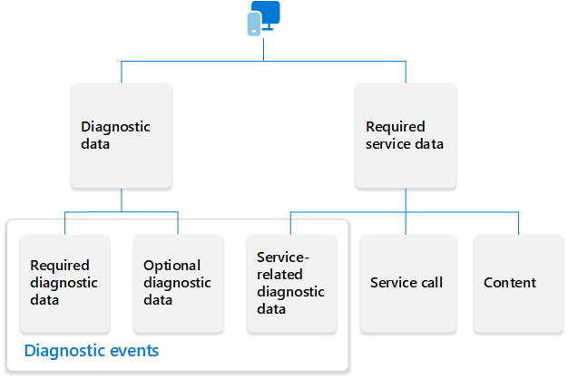

# Required service data for Microsoft 365 products

> [!NOTE]
> For a list of Microsoft 365 products covered by this privacy information, see [Privacy controls available for Office products](products-versions-privacy-controls.md).

As you use services with Microsoft 365 apps, such as inserting an image into a PowerPoint slide or updating to the latest version of Excel, data is sent to and processed by Microsoft to provide you with that functionality. This data, which we refer to as required service data, is necessary for Microsoft to deliver this functionality, helping ensure that it’s secure, up to date, and performing as expected.

[Connected experiences](connected-experiences.md), [Microsoft 365 Copilot](/copilot/microsoft-365/microsoft-365-copilot-transparency-note), and [essential services](essential-services.md) all generate required service data when you interact with Microsoft 365 apps.

- Connected experiences use cloud-based functionality to provide enhanced Microsoft 365 apps features. For example, Editor to help check grammar in Word documents or Focused Inbox to help organize your emails in Outlook.

- Microsoft 365 Copilot provides Microsoft 365 apps with the use of artificial intelligence (AI) backed functionality. For example, Copilot can summarize a long Word document or create action items from a Microsoft Teams meeting.

- Essential services are a set of services that are key to how Microsoft 365 apps function. For example, the licensing service that confirms that you’re properly licensed to use Microsoft 365 apps or Click-to-Run that helps update Microsoft 365 apps on Windows devices.

## Service calls, content, and service-related diagnostic data

Required service data isn’t a specific data type, such as Customer Data or Personal Data (which are defined in the [Microsoft Products and Services Data Protection Addendum (DPA)](https://www.microsoft.com/licensing/docs/view/Microsoft-Products-and-Services-Data-Protection-Addendum-DPA)). Instead, it’s a general description for all data required to be processed when interacting with a service through Microsoft 365 apps. It consists of the following distinct elements:

- **Service calls**, which are transient information and instructions needed by the service to perform its task.

- **Content**, which becomes Customer Data when stored and processed in Microsoft 365.

- **Service-related diagnostic data**, which includes information related to the operation of the connected experience that is needed to keep the underlying service secure, up to date, and performing as expected. This data doesn't include a user's name or email address, the content of the user's files, or information about apps unrelated to Office.

The following diagram illustrates the elements of required service data, including its relationship to client-related diagnostic data ([required diagnostic data](required-diagnostic-data.md) and [optional diagnostic data](optional-diagnostic-data.md)).

### Additional information about diagnostic events

- The diagnostic events that are part of required service data don’t contain content, but they may contain pseudonymized identifiers. These events are stored and processed as Personal Data in Microsoft 365.

- The diagnostic events collected for a specific user’s activity with Microsoft 365 apps can be reviewed in a Data Service Request (DSRs). For more information, see the [Microsoft Privacy Statement](https://www.microsoft.com/privacy/privacystatement), [Office 365 Data Subject Requests for the GDPR and CCPA](/compliance/regulatory/gdpr-dsr-Office365), and [Understanding Microsoft 365 diagnostic events in exported data](diagnostic-events-exported-data.md).

- The diagnostic events are grouped into event namespaces. Event namespaces signify the feature, application, or service that generates the event. For more information, see [Diagnostic event namespaces for Microsoft 365 products and Microsoft 365 Copilot](diagnostic-event-namespaces.md).

- The diagnostic events are collected using standard internet protocols. As documentation on those protocols is available online elsewhere, it’s not covered in this article.

## Example scenarios of the data collected and sent to Microsoft

Here are two examples of the required service data that could be collected and sent to Microsoft.

### Use Microsoft 365 Copilot to summarize a Word document

In Word, you ask Microsoft 365 Copilot to create a summary of the document. The data sent to Microsoft and processed to fulfill your request could include the following information.

**Service calls**

- The client IP address so the result can be returned.
- HTTP protocol information needed to manage the HTTP request.

**Content**

- The prompt that you provided to Microsoft 365 Copilot. For example, “Create a summary of the document.”
- Any grounding information needed to provide the response to the prompt. In this scenario, the contents of your document that you want Microsoft 365 Copilot to summarize.

**Service-related diagnostic data**

- Whether Microsoft 365 Copilot successfully returned a response.
- How long it took Microsoft 365 Copilot to respond.
- Whether you kept the summary suggested by Microsoft 365 Copilot.

### Use PowerPoint Designer to get slide design ideas

In PowerPoint, you ask PowerPoint Designer to provide design ideas for a slide. The data sent to Microsoft and processed to fulfill your request could include the following information.

**Service calls**

- The client IP address so the result can be returned.
- HTTP protocol information needed to manage the HTTP request.

**Content**

- The text or images you added to your slide.
- Which slide you’re working on and the slide’s layout.

**Service-related diagnostic data**

- Whether the design idea was correctly applied to your slide.
- Whether the interaction between PowerPoint and the Designer service performed as expected.

## Manage the data that is collected and sent to Microsoft

For connected experiences and Microsoft 365 Copilot, you can use our existing privacy controls and settings to prevent required service data from being collected and sent to Microsoft.

- For connected experiences, you can choose which types of connected experiences you want to use in Microsoft 365 apps. For example, if you choose to turn off [connected experiences that analyze your content](connected-experiences.md#connected-experiences-that-analyze-your-content), no required service data about those connected experiences is collected and sent to Microsoft. For more information, see [Overview of privacy controls for Microsoft 365 Apps for enterprise](overview-privacy-controls.md#connected-experiences-for-microsoft-365-apps-for-enterprise).

- For Microsoft 365 Copilot, some privacy settings for connected experiences can be used to turn off Microsoft 365 Copilot. For more information, see [Microsoft 365 Copilot and privacy controls for connected experiences](/copilot/microsoft-365/microsoft-365-copilot-privacy#microsoft-365-copilot-and-privacy-controls-for-connected-experiences).

For essential services, required service data is always collected and sent to Microsoft. You can’t turn off these essential services because they’re key to how Microsoft 365 apps function.
